# Examen Pratique DevOps – CV One Page

Ce dépôt contient tous les éléments nécessaires pour l'examen pratique DevOps visant à automatiser le déploiement d'une application **CV One Page** avec un pipeline CI/CD complet et la supervision via Grafana Cloud.

---

## Table des matières
1. [Structure du dépôt](#structure-du-dépôt)  
2. [Préparation de l'environnement](#préparation-de-lenvironnement)  
3. [Automatisation avec Ansible](#automatisation-avec-ansible)  
4. [Pipeline CI/CD avec Jenkins](#pipeline-cicd-avec-jenkins)  
5. [Déploiement Docker avec Terraform](#déploiement-docker-avec-terraform)  
6. [Orchestration Kubernetes avec K3s et Argo CD](#orchestration-kubernetes-avec-k3s-et-argo-cd)  
7. [Supervision et Monitoring avec Grafana Cloud](#supervision-et-monitoring-avec-grafana-cloud)  
 

---
## Structure du dépôt
Examen-Pratique/
│
├─ ansible/
│  ├─ inventory.yml
│  ├─ playbook.yml
│  └─ roles/
│     ├─ common/
│     ├─ docker/
│     ├─ jenkins/
│     └─ terraform/
│
├─ captures-Exam/
│
├─ cv-one-page/
│  ├─ Dockerfile
│  ├─ Jenkinsfile
│  └─ index.html
│
├─ k8s/
│  ├─ cv-deployment.yaml
│  ├─ cv-service.yaml
│
├─ README.md
├─ main.tf

## Préparation de l'environnement

- VM Ubuntu Server 24.04 nommée `DEVOPS-LAB`.  
- Accès par clés SSH depuis la machine locale (clé publique copiée dans `~/.ssh/authorized_keys`).  

- Commande de test SSH :
ssh mariem@192.168.1.28
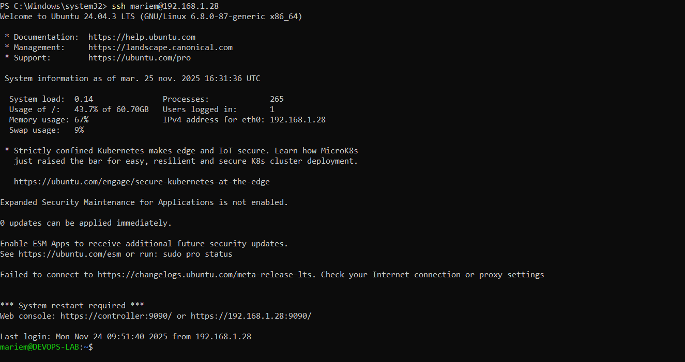

## Automatisation avec Ansible
1. créer roles :
ansible-galaxy init common
ansible-galaxy init docker
ansible-galaxy init jenkins
ansible-galaxy init terraform

2. Les rôles Ansible présents dans ansible/ automatisent :

Mise à jour du système (apt update && apt upgrade).

Installation de Docker.

Installation de Terraform.

Installation de Jenkins.

3. commande pour exécuter le playbook :

ansible-playbook -i inventory.yml playbook.yml 

## Pipeline CI/CD avec Jenkins

Récupération du code GitHub : https://github.com/mariammalki/cv-one-page.

Scrutation automatique toutes les 5 minutes.
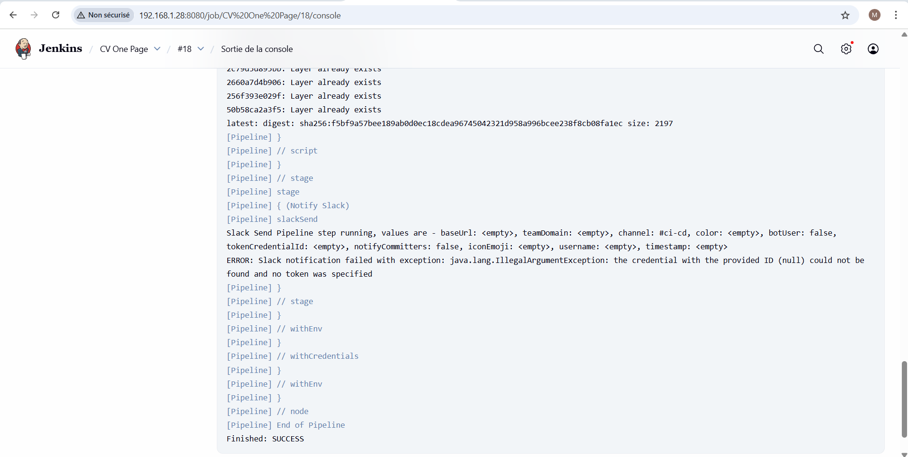
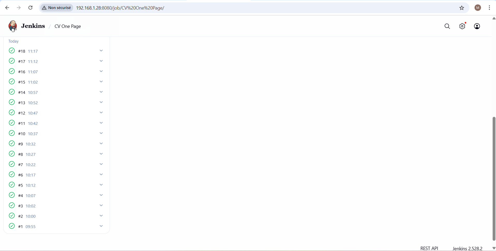
Construction de l'image Docker basée sur Nginx.

Push sur Docker Hub (compte : mariem507).

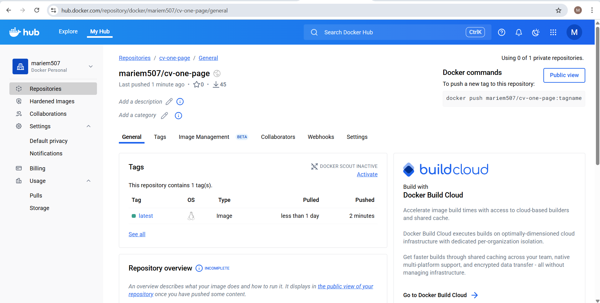

Notification Slack après exécution.

## Déploiement Docker avec Terraform

Terraform déploie un conteneur Docker nommé moncv

1. Ecrire le code (main.tf).
2. Initialiser (terraform init).
3. Planifier (terraform plan).
4. Appliquer (terraform apply).
5. Tester : http://<IP_VM>:8585 .
Test d’accès depuis la machine locale : http://192.168.1.28:8585.

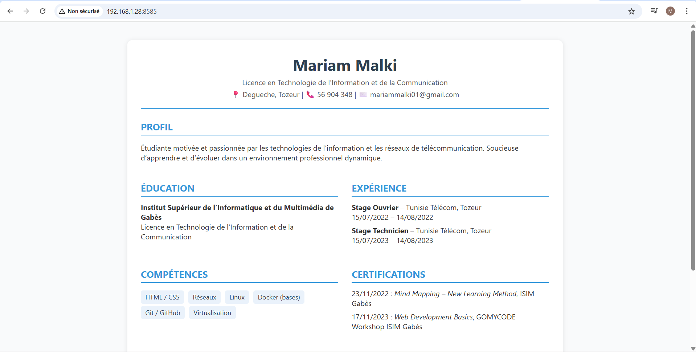

## Orchestration Kubernetes avec K3s et Argo CD

1. Installation K3s Single Node :

curl -sfL https://get.k3s.io | sh -
sudo k3s kubectl get nodes

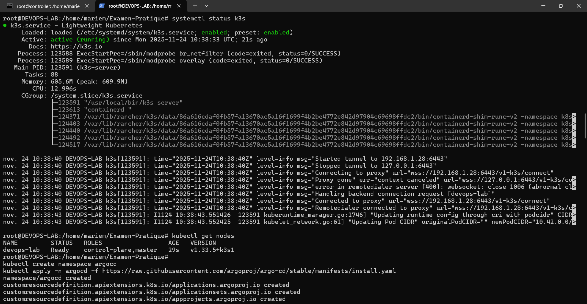

2. Déploiement via Argo CD :

Path du repo : k8s

Namespace : default

Sync Policy : Automatic

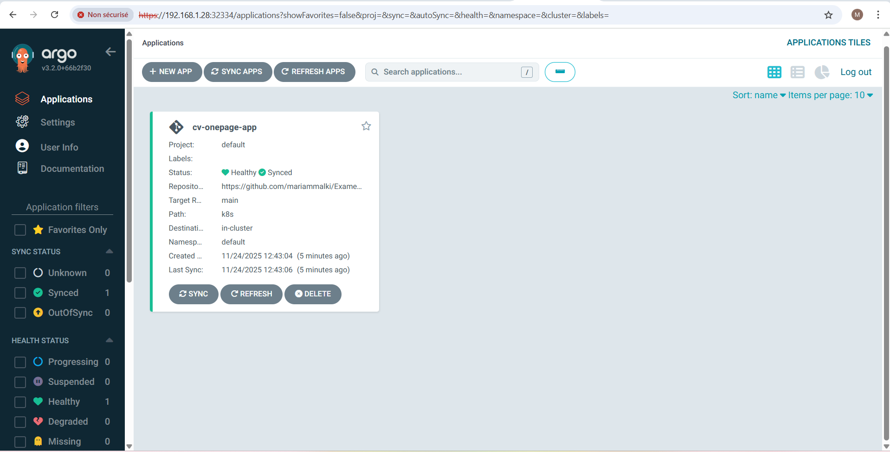

3. Test d’accès : http://192.168.1.28:30085.

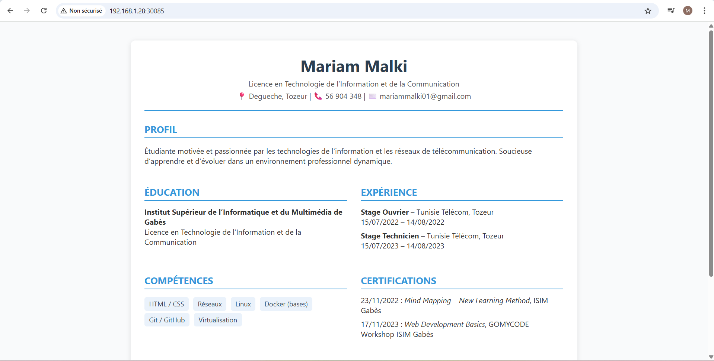

## Supervision et Monitoring avec Grafana Cloud

1. Création d’un compte Grafana Cloud (plan Free).

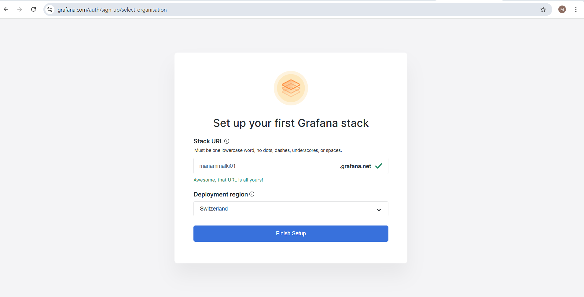

2. Créer une clé API (token)

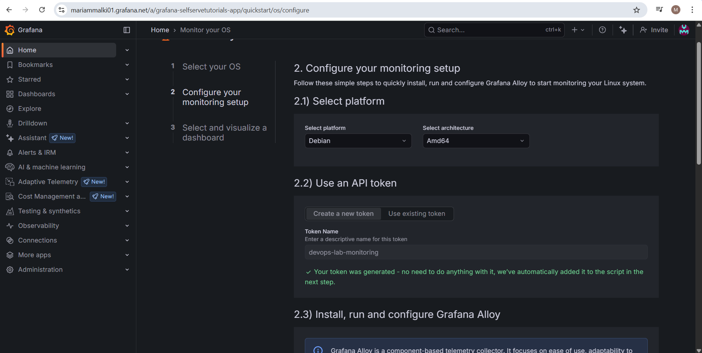

3. Installer Node Exporter (monitoring VM)
Node Exporter permet de collecter les métriques CPU, RAM, disque, réseau.

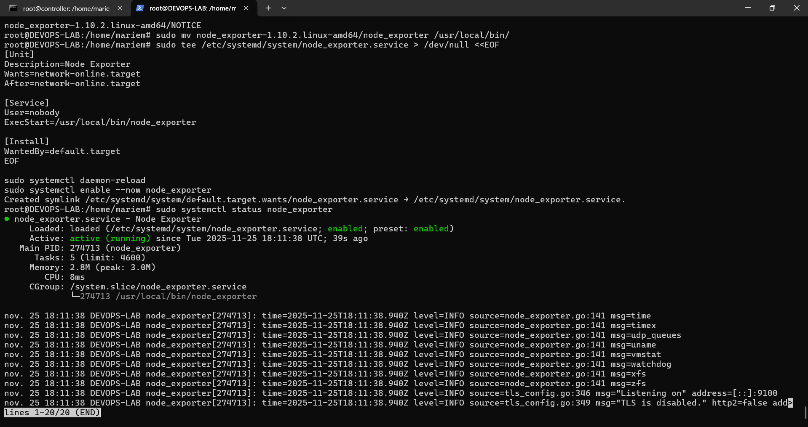

4. Installer cAdvisor (monitoring Docker)

cAdvisor collecte les métriques des conteneurs Docker.

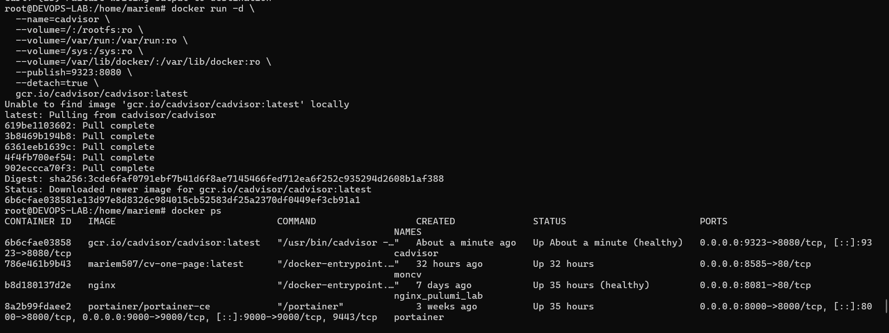

5. Installer metrics-server pour K3s

Objectif : Permettre de collecter les métriques des pods et du cluster Kubernetes.

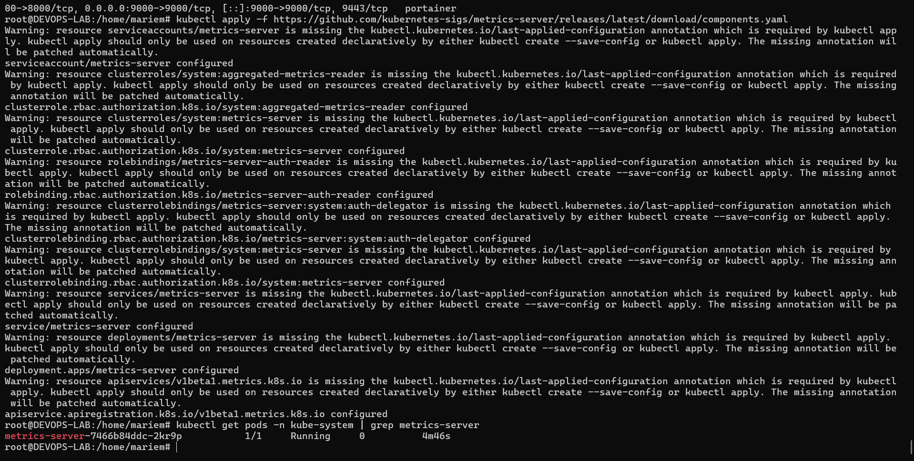

6. Installer Grafana Alloy (Agent) pour Grafana Cloud

Objectif : Envoyer toutes les métriques et logs collectés vers Grafana Cloud pour monitoring centralisé.

